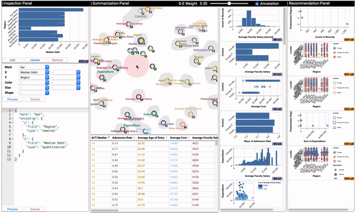

# ChartSeer

ChartSeer is a visualization tool that helps analysts steer their exploratory visual analysis (EVA) through dynamic visualization and recommendation of charts. ChartSeer employs a meta-visualization approach to present the charts already created, characterizing the state of current analysis achieved in multiple asynchronous sessions by the same or different analysts. ChartSeer leverages state-of-the-art deep learning models, [grammar variational autoencoder (GVAE)](https://arxiv.org/abs/1703.01925), to obtain a mapping between charts and vectors in a semantic space, and uses this mapping to create the meta-visualization of charts and enable interactive recommendation.

This repo contains the code for two main parts of the system: 1) the GVAE model (based on [GVAE](https://github.com/mkusner/grammarVAE)), and 2) the visualization tool (coming soon). The code is in corresponding with the following paper:

>Jian Zhao, Mingming Fan, Mi Feng. [ChartSeer: Interactive Steering Exploratory Visual Analysis with Machine Intelligence.](https://ieeexplore.ieee.org/document/9174891) IEEE Transactions on Visualization and Computer Graphics (to appear). 

## Dataset
The _sourcedata/_ folder contains a dataset of 9,917 visualization charts in the [VegaLite](https://vega.github.io/vega-lite/) format, including charts with one to four variables/encoding channels. This dataset is extended from the [Data2Vis dataset](https://github.com/victordibia/data2vis).

* _vegaspecs.txt_: Original raw VegaLite specifications
* _vegaspects-processed.txt_: Processed VegaLite specifications by removing dataset-specific information, i.e., replacing data variable names with _num_ (numerical) and _str_ (ordinal, nominal).

## VisGVAE model
This _gvae/_ folder contains the GVAE model for visualizations based on the code of the [original GVAE](https://github.com/mkusner/grammarVAE).
 
* _trainingdata/_: Generated training and testing datasets, as well as other files
* _trained/_: Pretrained models with the latent dimensions of 2 and 20 

To train and test the model, follow the instructions outlined in *data_utilis.py*

> The models were exported and tested using *Tensorflow 1.15*. More recent versions might fail to load the saved models due to differences.

## Visualization interface 
The ChartSeer user interface consists of a Chart Inspection Panel (left), Chart Summarization Panel (middle) including a Summarization View (middle top) and a Data Table View (middle bottom), and a Charts and Recommendation Panel (right) including a Chart List View (middle right), and a Chart Recommendation View (right). An analyst can easily gain knowledge about the overall landscape of their analysis, e.g., identifying clusters, trends, and gaps of users' behavior in creating charts. Further, an analyst could utilize this knowledge to obtain chart recommendations by interacting with the system, e.g., peeking into "holes" of the current analysis space to get appropriate charts automatically generated within local regions of interest. 

The front-end and back-end code of the interface is under the _interface/_ folder. 

* _client/_: Front-end code for the visualization interface
* _components/_: Third party components used in the front-end
* _server/_: Back-end NodeJS server for the front-end
* _staticdata/_: Example datasets served by the NodeJS server
* _modelserver.py_: Back-end Flask server for the recommendation engine based on VisGVAE 
* _gvaemodel/_: Copy of the code in _gvae/_ and trained models to support chart recommendation  

A video demo of the visualization tool can be viewed [here](https://www.youtube.com/watch?v=w5K1U6f1Oro).

To build the app:
* Install python packages: pip install -r requirements.txt (suggest using virtual environment https://docs.python.org/3/tutorial/venv.html)
* Install js packages: npm install
* Build for production: npm run build:prod

To run the app:
* Start the recommendation engine (Flask server): python modelserver.py
* Start the back-end NodeJS server: npm run start:prod
* Visit: http://localhost:8000/index.html

Alternatively, for development (live code update):
* Start recommendation engine: python modelserver.py
* Start development: npm start

The app supports a JSON format input, consisting a list of charts specified in Vega-Lite and a data array for the charts. See _staticdata/_ for examples. The input data can be loaded via an url or a file upload, in the right format. Note that no format checking is performed. By default, the _cars.json_ is loaded when the app starts.   